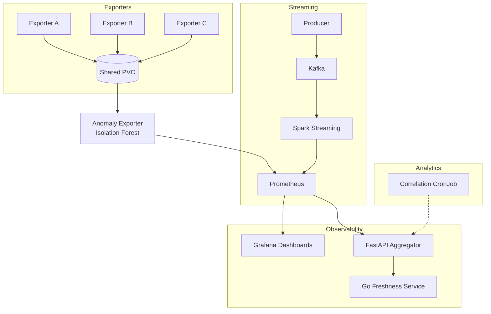

# DTMS Platform
### Distributed Transfer Monitoring System – OpenShift Deployment

[](https://www.openshift.com/)
[](https://kubernetes.io/)
[](https://www.python.org/)
[](https://golang.org/)
[](LICENSE)

## Table of Contents
- [Overview](#overview)
- [Architecture](#architecture)
- [Core Features](#core-features)
- [Technology Stack](#technology-stack)
- [Getting Started](#getting-started)
- [Design Decisions](#design-decisions)
- [Limitations](#limitations)
- [Future Roadmap](#future-roadmap)
- [License](#license)

## Overview

**DTMS Platform** is an OpenShift-based distributed monitoring system designed to simulate and monitor multi-site data transfers across heterogeneous infrastructure.

This project demonstrates modern cloud-native patterns including distributed monitoring, observability, and reliability engineering in resource-constrained cluster environments.

### Key Capabilities

- 🌐 **Multi-site transfer exporters** (SITE_A, SITE_B, SITE_C)
- 📊 **Real-time metric collection** with Prometheus
- 📈 **Visualization** with Grafana dashboards
- 🤖 **Anomaly detection** using Isolation Forest ML
- 🚀 **Streaming pipeline** with Kafka + Spark
- 🔌 **REST API** powered by FastAPI
- ✅ **Data freshness validation** (Go microservice)
- 📉 **Correlation analytics** via Kubernetes CronJobs
- 🐳 **Containerized deployment** on OpenShift
- ⚡ **Resource-optimized** for strict **3 vCPU quota** environments

---

## Architecture

The system follows a distributed producer-consumer pattern with centralized observability and batch analytics.


### Data Flow

1. **Exporters (A/B/C)** write simulated transfer data to a shared PVC
2. **Anomaly Exporter** reads data and applies Isolation Forest detection
3. **Prometheus** scrapes metrics from all services
4. **FastAPI** aggregates anomalies and provides REST interface
5. **Go Service** validates data freshness in real-time
6. **CronJob** runs periodic correlation analytics

---

## Core Features

### 🔹 Multi-Site Monitoring

Three independent exporters simulate distributed transfer activity across heterogeneous sites, replicating real-world multi-datacenter scenarios.

### 🔹 Centralized Metrics

Prometheus scrapes comprehensive metrics:
- Transfer throughput and latency
- Anomaly detection scores
- Streaming event rates
- Data freshness heartbeats
- System health indicators

### 🔹 Anomaly Detection

Implements **Isolation Forest** machine learning model:
- Detects approximately **5%** anomalous transfers
- Real-time scoring based on transfer patterns
- Publishes anomaly ratios and confidence scores
- Adaptive threshold management

### 🔹 Streaming Pipeline

Built on **Kafka + Spark Streaming**:
- High-throughput event processing
- Per-batch aggregation
- Real-time metric exposure
- Fault-tolerant architecture

### 🔹 Data Freshness Service

Lightweight **Go microservice** for reliability monitoring:
- Polls API to validate system liveness
- Computes per-site data freshness metrics
- Exposes `dtms_data_fresh_seconds` and `dtms_data_fresh_ok`
- Minimal resource footprint

### 🔹 Correlation Analytics

**Kubernetes CronJob** for batch processing:
- Analyzes anomaly patterns vs throughput
- Computes correlation coefficients
- Automated execution every 10 minutes
- Exports findings to monitoring stack

### 🔹 Resource-Constrained Design

Engineered for sandbox and edge environments:
- **Hard Limit**: Operates under **3 vCPU** request quota
- **Memory Optimized**: Minimal footprint per service
- **Storage Efficient**: Shared RWX PVC strategy
- **Cost-Effective**: Suitable for free-tier clusters

---

## Technology Stack

| Layer | Technology | Purpose |
|-------|-----------|---------|
| **Core Logic** | Python 3.9+ | Main exporters and ML models |
| **Microservice** | Go 1.19+ | Freshness validation |
| **API** | FastAPI | REST aggregation layer |
| **Streaming** | Kafka + Spark | Real-time event processing |
| **Monitoring** | Prometheus | Metric collection & TSDB |
| **Visualization** | Grafana | Dashboard & alerting |
| **Orchestration** | OpenShift / K8s | Container orchestration |
| **Storage** | PVC (RWX) | Shared persistent volume |
| **ML** | scikit-learn | Isolation Forest model |

---

## Getting Started

### Prerequisites

- OpenShift 4.x or Kubernetes 1.24+
- `kubectl` or `oc` CLI tool
- Access to a cluster namespace
- At least 3 vCPU and 4Gi memory quota

### Quick Deploy
```bash
# Clone the repository
git clone https://github.com/yourusername/dtms-platform.git
cd dtms-platform

# Create namespace
oc new-project dtms-monitoring

# Deploy storage
oc apply -f k8s/storage/

# Deploy services
oc apply -f k8s/deployments/
oc apply -f k8s/services/
oc apply -f k8s/routes/

# Deploy monitoring
oc apply -f k8s/config/

# Deploy analytics
oc apply -f k8s/cronjobs/

# Verify deployment
oc get pods -n dtms-monitoring
```

### Access the Services
```bash
# Get routes
oc get routes

# Access Grafana Dashboard
open $(oc get route grafana -o jsonpath='{.spec.host}')

# Access API Documentation
open $(oc get route dtms-api -o jsonpath='{.spec.host}')/docs
```
---

## Design Decisions

### Why Go for Freshness?

- **Lightweight**: 10x smaller memory footprint vs Python equivalent
- **Performance**: Sub-millisecond response times
- **Polyglot Showcase**: Demonstrates multi-language architecture
- **Sidecar Pattern**: Ideal for health-check microservices

### Why CronJob for Correlation?

- **Resource Efficiency**: Avoids continuous CPU usage
- **Batch Pattern**: Analytics valuable in periodic intervals
- **Quota Management**: Fits within 3 vCPU constraint
- **Kubernetes Native**: Leverages built-in scheduling

### Why Shared PVC (RWX)?

- **Simplicity**: No external object storage (S3) needed
- **Unified Source**: Single source of truth for all readers
- **Sandbox Friendly**: Works in constrained environments
- **Cost Effective**: No egress charges

---

## Limitations

- **Sandbox Optimized**: Tuned for development clusters, not production-scale
- **Kafka Configuration**: Single broker, limited Zookeeper resources
- **Security**: No TLS between internal services (demo environment)
- **Scaling**: Not currently configured for horizontal pod autoscaling
- **Persistence**: Limited retention policies for demo purposes

---

## Future Roadmap

- [ ] Horizontal scaling with ReplicaSets
- [ ] PushGateway integration for correlation metrics
- [ ] Helm Chart packaging
- [ ] GitLab CI/CD pipeline automation
- [ ] Alertmanager integration for anomaly thresholds
- [ ] Synthetic fault injection testing
- [ ] TLS/mTLS for service mesh
- [ ] Multi-cluster federation support
- [ ] Advanced ML models (LSTM, Prophet)
- [ ] Cost optimization metrics

---

## License

This project is licensed under the MIT License - see the [LICENSE](LICENSE) file for details.

---

## Acknowledgments

- Inspired by real-world distributed monitoring challenges
- Built with modern cloud-native best practices
- Designed for learning and demonstration purposes

---

**Built with ❤️ for the OpenShift and Kubernetes community**
